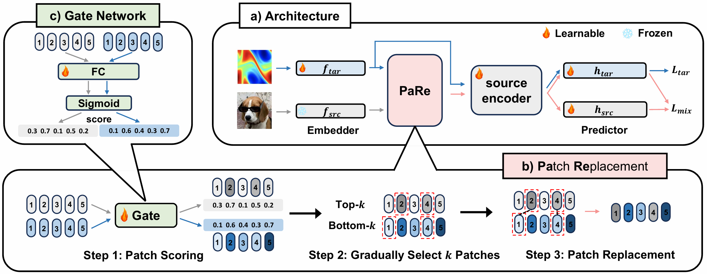

 ---

<div align="center">    
 
# Enhancing Cross-Modal Fine-Tuning with Gradually Intermediate Modality Generation

[ICML2024] Official Code of Enhancing Cross-Modal Fine-Tuning with Gradually Intermediate Modality Generation

[Lincan Cai](https://scholar.google.com/citations?user=wH-dNbAAAAAJ&hl=zh-CN&oi=ao), [Shuang Li](https://shuangli.xyz), [Wenxuan Ma](https://scholar.google.com/citations?hl=zh-CN&user=u7aJOt8AAAAJ), Jingxuan Kang, [Binhui Xie](https://binhuixie.github.io), Zixun Sun and Chengwei Zhu



</div>

## Contribution
- We gradually constructs intermediate modalities from the source modality to the target modality, bridging the modality gap.
- By mixing the source modality data with the target modality data to construct intermediate modality data, we can also alleviates the issue of insufficient data volume in the target modality.
- Utilize Curriculum Learning, allowing the model to transition from intermediate modality data that is closer to the source modality to that is closer to the target modality. This enables a gradual transfer from easy to difficult tasks.

## Requirements
- Please refer to the Requirements of [ORCA](https://github.com/sjunhongshen/ORCA).
- Download required datasets and precomputed language features [text_xs.py](https://www.dropbox.com/scl/fi/dhrrsh7yaihrecp6t2sta/text_xs.npy?rlkey=yfozu8n1pxpoxiqke2bggzitr&e=1&dl=0) and [text_ys.py](https://www.dropbox.com/scl/fi/8yfju7faakf3q24fkbknz/text_ys.npy?rlkey=nmj4g7j236zfyopictt2ljjsr&e=1&dl=0) to ```./src/datasets``` when using RoBERTa models for 1D datasets.

## Experiment with NAS-Bench-360
Run the following command:
```bash
bash run_PaRe.sh

```

## Citation
If you find this project useful in your research, please consider citing:
```latex
@inproceedings{caienhancing,
  title={Enhancing Cross-Modal Fine-Tuning with Gradually Intermediate Modality Generation},
  author={Cai, Lincan and Li, Shuang and Ma, Wenxuan and Kang, Jingxuan and Xie, Binhui and Sun, Zixun and Zhu, Chengwei},
  booktitle={Forty-first International Conference on Machine Learning}
}
```

## Acknowledgements
This project is based on the project: [ORCA](https://github.com/sjunhongshen/ORCA). We thank the authors for making the source code publicly available.
